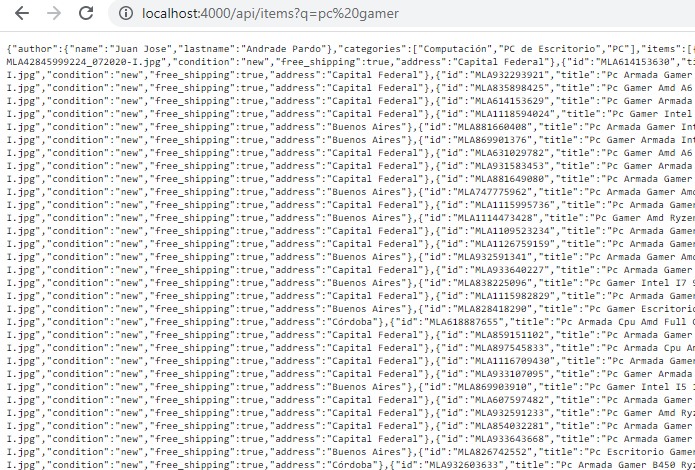

<div id="top"></div>

<br />
<div align="center">
  
  

  <h3 align="center">Merc App Backend</h3>

  <p align="center">
    Consult Products, prices and details
    <br />
  </p>
</div>


<!-- TABLE OF CONTENTS -->
<details>
  <summary>Table of contents</summary>
  <ol>
    <li>
      <a href="#about-the-project">About The Project</a>
      <ul>
        <li><a href="#built-with">Built With</a></li>
      </ul>
    </li>
    <li>
      <a href="#getting-started">Getting Started</a>
      <ul>
        <li><a href="#prerequisites">Prerequisites</a></li>
        <li><a href="#installation">Installation</a></li>
      </ul>
    </li>
    <li><a href="#usage">Usage</a></li>
  </ol>
</details>


<!-- ABOUT THE PROJECT -->
## About The Project



Merc App is an E-commerce project that allows the user to consult different products, their prices and details. This project consists of two parts and in this repository you can find the Backend part of the project.
### Built With

* [Node.js](https://nodejs.org/es/)
* [Express](https://expressjs.com/)

<p align="right">(<a href="#top">back to top</a>)</p>


<!-- GETTING STARTED -->
## Getting Started

### Prerequisites

* Install Node Js using the webpage or using NVM
  ```sh
  https://nodejs.org/es/
  ```

### Installation and Server Activation


1. Clone the repo
   ```sh
   git clone git@github.com:JuanMercApp/merc-backend.git
   ```
2. Install NPM packages
   ```sh
   npm install
   ```
3. Run server
   ```sh
   npm start
   ```

<p align="right">(<a href="#top">back to top</a>)</p>


<!-- USAGE EXAMPLES -->
## Usage

This application has the following two endpoints enabled:
1. /api/items/:productId 2.
I.E: /api/items/MLA931583453
2. api/items?q="searchString"
I.E: api/items?q=pc

<p align="right">(<a href="#top">back to top</a>)</p>
